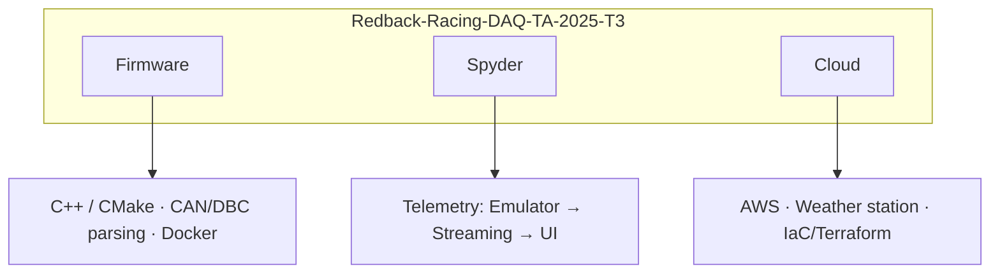
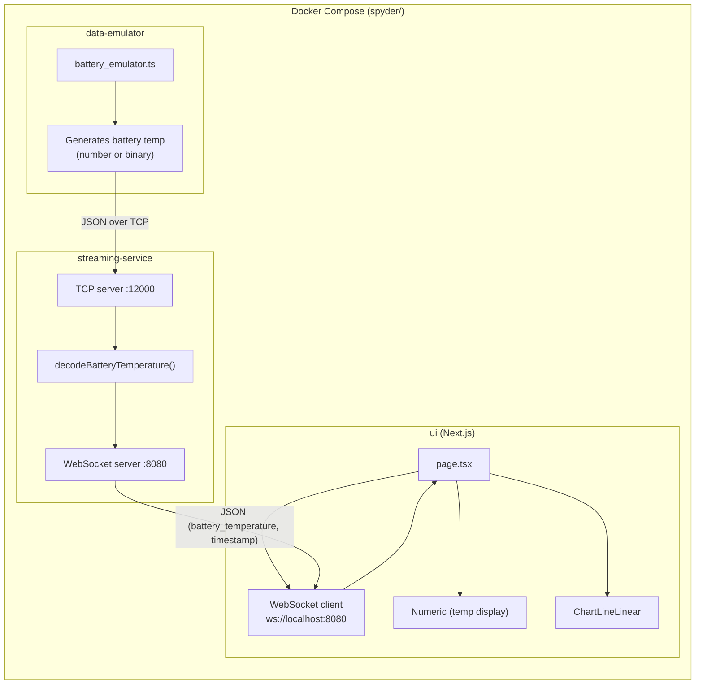
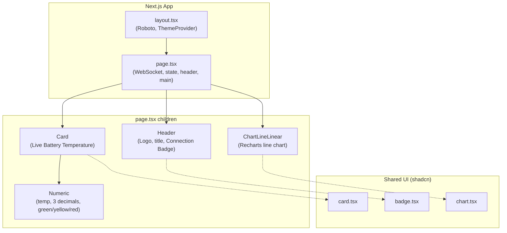
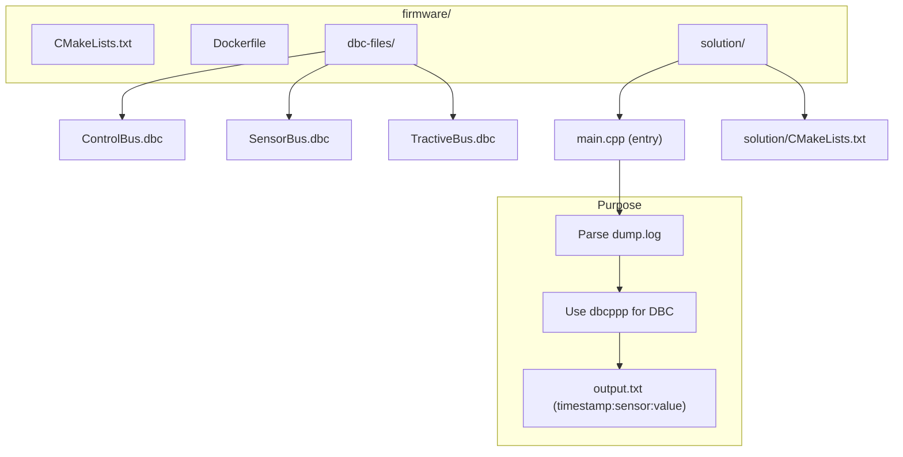

# Redback Racing DAQ – Codebase Diagram

High-level structure and data flow of the technical assessment repo.

---

## 1. Project overview (three themes)

---

## 2. Spyder telemetry system (data flow)

---

## 3. Spyder – UI component tree

---

## 4. Firmware layout

---

## 5. File / folder map

| Area        | Path | Main pieces |
|------------|------|-------------|
| **Root**   | `/` | `README.md`, `brainstorming.md` |
| **Spyder** | `spyder/` | `docker-compose.yml`, `docs/README.md` |
| **Data emulator** | `spyder/data-emulator/` | `src/battery_emulator.ts` (TCP client → streaming-service:12000) |
| **Streaming** | `spyder/streaming-service/` | `src/server.ts` (TCP :12000, WebSocket :8080) |
| **UI**     | `spyder/ui/` | Next.js, `src/app/page.tsx`, `layout.tsx`, `components/custom/` (numeric, chart-line-linear, theme-provider), `components/ui/` (card, badge, chart) |
| **Firmware** | `firmware/` | `solution/main.cpp`, `CMakeLists.txt`, `dbc-files/*.dbc`, `Dockerfile` |
| **Cloud**  | `cloud/` | `docs/README.md`, `cloud_diagram.drawio` |

---

*To view Mermaid diagrams: use a Markdown preview with Mermaid support (e.g. VS Code extension, GitHub), or paste the code blocks into [mermaid.live](https://mermaid.live).*
